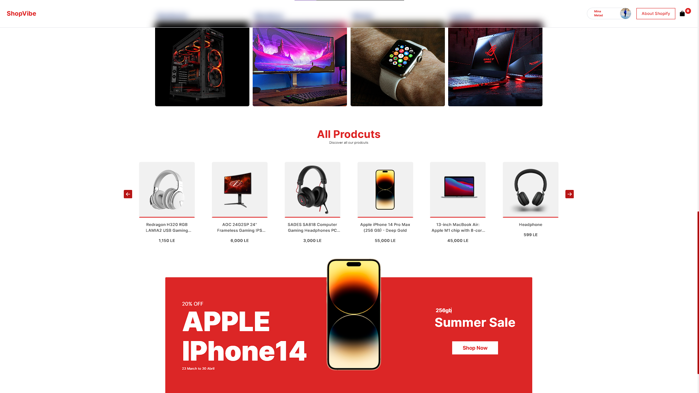

<h1 align='center'>ShopVipe</h1>

<p align="center">
  
</p>
<h2>Demo</h2>

🔥 [Live Demo](https://shop-vipe.vercel.app/#/)

<h2>Built with</h2>

<h3>Front-End</h3>

- React
- Tailwind CSS
- Sanity

</br>

<h1>What is the ShopVipe 🌐</h1>

<p> e-commerce website, built using React, React Router, and Tailwind CSS! This project was a significant learning experience for me, as it allowed me to work with a wide range of functionalities typically found in any online store.
</p>


<h2>🚀 Key Features</h2>

- Google OAuth Authentication 🌐: Secure user login via Google accounts.

- Sanity Database Integration 🔄: Dynamic content, easy product/category management.

- Fully Functional Cart System 🛒: Seamless product addition, smooth checkout.

- User Reviews and Comments 💬: Valuable feedback on products.

- Sleek and Modern UI with Tailwind CSS 🎨: Visually appealing, responsive design.

- Responsive Design 📱💻: Accessible on desktop and mobile.

- Enhanced User Experience 🌟: Focus on enjoyable shopping.

</br>

<h2>Screenshots</h2>


</br>

<h2>Development</h2>

Here are the steps to start the project locally.

1. Clone the repository

```sh
HTTPS - $ git clone https://github.com/Mina-Massoud/Shop-Vipe.git
```

3. Install the dependencies.

```sh
$ npm i
```


```sh
$ npm run dev
```
